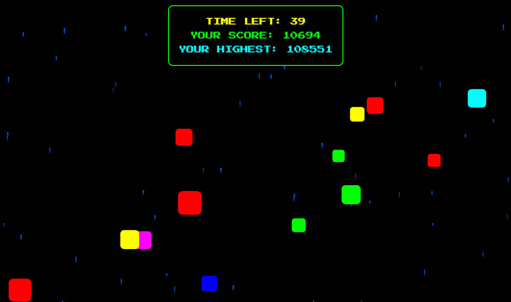

# Smashing Squares

A fast-paced arcade game where you destroy colorful squares through collisions and explosions.

## How to Play

- **Double Click**: Explode squares instantly
- **Drag & Smash**: Grab squares and crash them into others for bonus points
- You have 60 seconds to score as many points as possible
- Smaller squares are worth more points
- Drag-and-smash collisions award 5x points

## Features

- Colorful particle explosions
- Dynamic difficulty scaling
- Local high score tracking
- Retro-style pixel font
- Sound effects with pitch variation
- Smooth drag-and-drop mechanics

## Technologies Used

- HTML5 Canvas
- Vanilla JavaScript
- CSS3 Animations
- Local Storage for score persistence

## Installation

1. Clone the repository
2. Open `index.html` in your browser
3. Start smashing squares!

## Controls

- Mouse click/tap for interactions
- Double click to explode squares
- Click and drag to grab squares

## Credits

- Font: Press Start 2P (Google Fonts)
- Sound effects: Custom-made explosion sounds